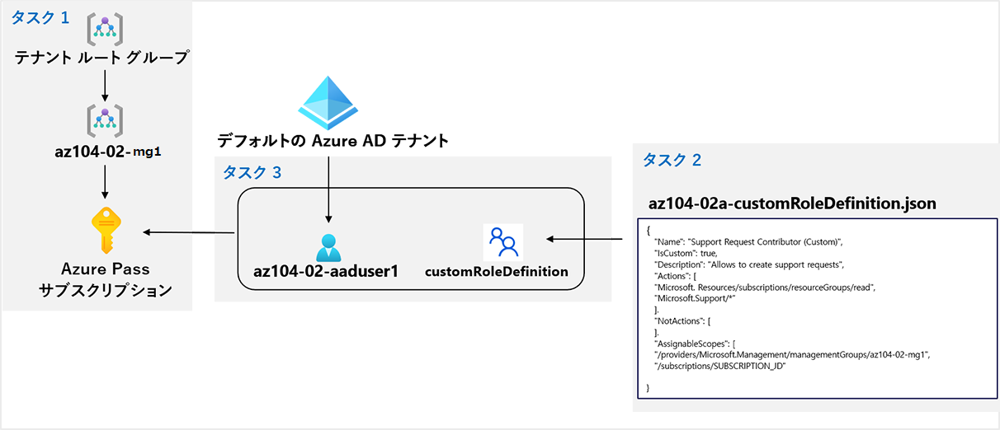

---
lab:
    title: '02a - サブスクリプションと RBAC を管理する'
    module: 'モジュール 02 - ガバナンスとコンプライアンス'
---

# ラボ 02a - サブスクリプションと RBAC を管理する
# 受講生用ラボ マニュアル

## ラボ シナリオ

Contoso の Azure リソースの管理を強化するために、次の機能を実装する任務を負いました。

- Contoso のすべての Azure サブスクリプションを含む管理グループを作成する

- 管理グループ内のすべてのサブスクリプションに対するサポート要求リクエストのアクセス許可を、指定された Azure Active Directory ユーザーに付与する。そのユーザーのアクセス許可は、次の場合に限定する必要があります。 

    - サポート要求チケットの作成
    - リソース グループの表示 

## 目標

このラボでは次の内容を学習します。

+ タスク 1: 管理グループを実装する
+ タスク 2: カスタム RBAC ロールを作成する 
+ タスク 3: RBAC ロールを割り当てる


## 推定時間: 30 分

## アーキテクチャの図




## 手順

### 演習 1

#### タスク 1: 管理グループを実装する

このタスクでは、管理グループを作成および構成します。 

1. [Azure portal](https://portal.azure.com) にサインインします。

1. **「管理グループ」** を検索して、選択し、**「管理グループ」** ブレードに移動します。

1. **「管理グループ」** ブレードで、**「+ 作成」** をクリックします。

    >**注**: 以前に管理グループを作成していない場合は、**「管理グループの使用を開始します」** を選択します。

1. 次の設定で管理グループを作成します。

    | 設定 | 値 |
    | --- | --- |
    | 管理グループ ID | **az104-02-mg1** |
    | 管理グループの表示名 | **az104-02-mg1** |

1. 管理グループのリストで、新しく作成された管理グループを表すエントリをクリックしします。

1. **「az104-02-mg1」** ブレードで、**「サブスクリプション」** をクリックします。 

1. **「az104-02-mg1 \| サブスクリプション」** ブレードで、**「+ 追加」** をクリックし、**「サブスクリプションの追加」** ブレードの **「サブスクリプション」** ドロップダウンリストから、このラボで使用するサブスクリプションを選択して **「保存」** をクリックします。

    >**注**: 「**az104-02-mg1 \| サブセクション**」ブレードで、Azure サブスクリプションの ID をクリップボードにコピーします。これは、次のタスクで必要になります。

#### タスク 2: カスタム RBAC ロールを作成する

このタスクでは、カスタム RBAC ロールの定義を作成します。

1. ローカルPC上に保存されている **\\Allfiles\\Labs\\02\\az104-02a-customRoleDefinition.json** ファイルをメモ帳で開き、その内容を確認します。

   ```json
   {
      "Name": "Support Request Contributor (Custom)",
      "IsCustom": true,
      "Description": "Allows to create support requests",
      "Actions": [
          "Microsoft.Resources/subscriptions/resourceGroups/read",
          "Microsoft.Support/*"
      ],
      "NotActions": [
      ],
      "AssignableScopes": [
          "/providers/Microsoft.Management/managementGroups/az104-02-mg1",
          "/subscriptions/SUBSCRIPTION_ID"
      ]
   }
   ```
   
1. JSON ファイルの `SUBSCRIPTION_ID` プレースホルダーをクリップボードにコピーしたサブスクリプション ID に置き換え、変更を保存します。

1. Azure portal で、**「Cloud Shell」** ウィンドウを開くには、画面上部にある検索テキストボックスの右側にあるツールバー アイコンを直接クリックします。

1. **Bash** や **PowerShell** のどちらかを選択するためのプロンプトが表示されたら、**PowerShell** を選択します。 

    >**注**: **Cloud Shell** の初回起動時に **「ストレージがマウントされていません」** というメッセージが表示された場合は、このラボで使用しているサブスクリプションを選択し、**「ストレージの作成」** を選択します。 

1. 「Cloud Shell」 ウィンドウのツールバーで、**「ファイルのアップロード/ダウンロード」** アイコンをクリックし、ドロップダウン メニューの **「アップロード」** をクリックして、ファイル **\\Allfiles\\Labs\\02\az104-02a-customRoleDefinition.json** を Cloud Shell のホーム ディレクトリにアップロードします。

1. Cloud Shell ウィンドウから、次の操作を実行して、カスタム ロール定義を作成します。

   ```powershell
   New-AzRoleDefinition -InputFile $HOME/az104-02a-customRoleDefinition.json
   ```

1. 「Cloud Shell」 ペインを閉じます。

#### タスク 3: RBAC ロールを割り当てる

このタスクでは、Azure Active Directory ユーザーを作成し、前のタスクで作成した RBAC ロールをそのユーザーに割り当て、ユーザーが RBAC ロール定義で指定されたタスクを実行できることを確認します。

1. Azure portal の「Azure Active Directory」ブレードで、**「Azure Active Directory」** を検索して選択し、**「ユーザー」** をクリックして、**「+ 新しいユーザー」** をクリックします。

1. 次の設定で、新しいユーザーを作成します (他の設定は既定値のままにします)。

    | 設定 | 値 |
    | --- | --- |
    | ユーザー名 | **az104-02-aaduser1**|
    | 名前 | **az104-02-aaduser1**|
    | パスワード | **自分でパスワードを作成する** |
    | 初期パスワード | **Pa55w.rd1234** |

    >**注**: **クリップボードに**完全な**ユーザー名**をコピーします。これは、このラボで後ほど必要になります。

1. Azure portal で、**az104-02-mg1** 管理グループのブレードに戻ります。

1. **「アクセス制御 (IAM)」** をクリックし、**「+ 追加」**、**「ロールの割り当ての追加」** の順にクリックし、新しく作成した**az104-02-aaduser1**に**Support Request Contributor (Custom)** の役割を割り当てます。

1. **「InPrivate」** ブラウザー ウィンドウを開き、**az104-02-aaduser1**を使用して [Azure portal](https://portal.azure.com) にログインします。パスワードの更新を求められたら、ユーザー用にパスワードを変更します。

1. Azure portal の **「InPrivate」** ブラウザー ウィンドウで、**「リソース グループ」** を検索して選択し、az104-02-aaduser1 ユーザーがすべてのリソース グループを表示できることを確認します。

1. Azure portal の **「InPrivate」** ブラウザー ウィンドウで、**「すべてのリソース」** を検索して選択し、az104-02-aaduser1 ユーザーがリソースを表示できないことを確認します。

1. Azure portal の **「InPrivate」** ブラウザー ウィンドウで、**「ヘルプとサポート」** を検索して選択し、**「サポートリクエストの作成」** をクリックします。 

1. 「**InPrivate**」ブラウザー ウィンドウの「**新しいサポート リクエスト**」ブレードにおいて、「**お客様の問題は何に関係していますか**」では「**Azure サービス**」を選択します。
    「**概要**」に「**クォータの引き上げ**」と入力し、「**問題の種類**」タブで、「**サービスとサブスクリプションの制限(クォータ)**」選択し、「**サブスクリプション**」ドロップダウン リストにご自身のサブスクリプションが表示されていることを確認してください。
    
    >**注**: カスタムロールで、「サポート」の権限が付与されているため、サブスクリプションが表示されます。
    
1. サポート要求の作成を続行せず、ホーム画面に戻ってください。

#### リソースをクリーン アップする

   >**注**: この課題で作成したリソースで余分なコストは発生しませんが、未使用のリソースを削除すると予期しない料金は発生しなくなります。

1. Azure portal で **「Azure Active Directory」** を検索して選択し、「Azure Active Directory」 ブレードで、**「ユーザー」** をクリックします。

1. **「ユーザー - すべてのユーザー」** ブレードで **「az104-02-aaduser1」** をクリックします。

1. **「az104-02-aaduser1 - プロファイル」** ブレードで、**「オブジェクト ID」** 属性の値をコピーします。

1. Azure portal 内の **「Cloud Shell」** で **PowerShell** セッションを開始します。

1. 「Cloud Shell」 ウィンドウで、次の手順を実行してカスタム ロール定義の割り当てを削除します (`[object_ID]` プレースホルダーを、このタスクの前半でコピーした **az104-02-aaduser1** の Azure Active Directory ユーザー アカウントの **object ID** 属性の値で置き換えます)。

   ```powershell
   $scope = (Get-AzRoleAssignment -RoleDefinitionName 'Support Request Contributor (Custom)').Scope

   Remove-AzRoleAssignment -ObjectId '[object_ID]' -RoleDefinitionName 'Support Request Contributor (Custom)' -Scope $scope
   ```

1. 「Cloud Shell」 ウィンドウから次の手順を実行して、カスタム ロールの定義を削除します。

   ```powershell
   Remove-AzRoleDefinition -Name 'Support Request Contributor (Custom)' -Force
   ```

1. Azure portal で、**Azure Active Directory** の **「ユーザー - すべてのユーザー」** ブレードに戻り、**az104-02-aaduser1** ユーザー アカウントを削除します。

1. Azure portal で、**「管理グループ」** ブレードに戻ります。 

1. **「管理グループ」** ブレードで、「**Tenant Root Group**」の右横にある**省略記号**アイコン「・・・」を選択し、**「ここでサブスクリプションを追加」** を選択し、「**Azure Pass スポンサープラン**」のサブスクリプション選びを保存します。

1. **「更新」** を選択して、サブスクリプションが「**Tenant Root Group**」に正常に移動したことを確認します。

1. **「管理グループ」** ブレードに戻り、**az104-02-mg1** 管理グループの右側にある **「省略記号」** アイコン「・・・」を右クリックし、**「削除」** をクリックします。

#### 確認

このラボでは次の内容を学習しました。

- 管理グループを作成しました
- カスタム RBAC ロールを作成しました 
- RBAC ロールを割り当てました
