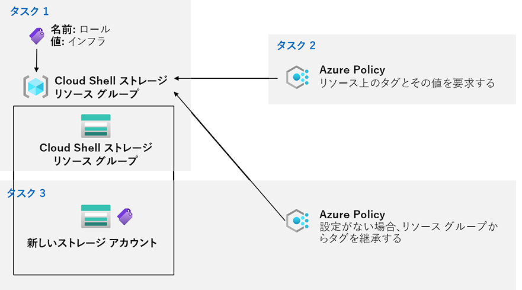

---
lab:
    title: '02b - Azure Policy を介してガバナンスを管理する'
    module: 'モジュール 02 - ガバナンスとコンプライアンス'
---

# ラボ 02b - Azure Policy を介してガバナンスを管理する
# 受講生用ラボ マニュアル

## ラボ シナリオ

Contoso の Azure リソースの管理を強化するために、次の機能を実装する任務を負いました。

- Cloud Shell ストレージ アカウントなどインフラストラクチャ リソースのみを含むリソース グループにタグを付ける

- 適切にタグ付けされたインフラストラクチャ リソースのみを、インフラストラクチャ リソース グループに追加できるようにする

- 非準拠リソースを修復する 

## 目標

このラボでは次の内容を学習します。

+ タスク 1: Azure portal を介して タグを作成し、割り当てる
+ タスク 2: Azure Policy を使用してタグ付けを強制する
+ タスク 3: Azure Policy を使用してタグ付けを適用する

## 推定時間: 30 分

## アーキテクチャの図

## 手順

### 演習 1

#### タスク 1: Azure portal を使用してタグを割り当てる

このタスクでは、Azure portal を介してタグを作成し、Azure リソース グループに割り当てます。

1. Azure portalで「**リソースグループ**」と検索します。

1. 一覧から「**cloud-shell-storage-southeastasia**」を選択します。

    >**注**: 「cloud-shell-storage-southeastasia」がない場合、いずれかを実施してください。
    >
    >　　a. Cloud Shellを起動して、ストレージアカウントを作成すると、自動的に
    >
    >　　   「cloud-shell-storage-southeastasia」が作成されます。
    >
    >　　b.「cloud-shell-storage-XXXX」で別の地域が表示されている場合があります。
    >
    >　　　 地域が違う場合でも演習は実施できます。読み替えて演習を実施してください。

1. 「リソース グループ」ブレードで **「タグ」** をクリックします。

1. 次の設定でタグを作成し、変更を保存します。

    | 設定 | 値 |
    | --- | --- |
    | 名前 | **Role** |
    | 値 | **Infra** |

1. ストレージ アカウントの概要ブレードに戻り、タグが追加されていることを確認してください。

#### タスク 2: Azure Policy を使用してタグ付けを強制する

このタスクでは、*「リソースでタグとその値が必要」* という組み込みポリシーをリソース グループに割り当て、結果を評価します。 

1. Azure portal で、**「ポリシー」** を検索して選択します。 

1. 「**作成**」 セクションで 「**定義**」 をクリックします。

1. 検索で「**タグとその値がリソースに必要**」 という組み込みポリシーを表すエントリをクリックします。え

1. 「**タグとその値がリソースに必要**」ブレードで、「**割り当て**」 をクリックします。

1. スコープの「省略記号」ボタン「・・・」をクリックして次の値を選択し、**スコープ**を指定します。

    | 設定 | 値 |
    | --- | --- |
    | サブスクリプション | **Azure Pass スポンサー プラン**      |
    | リソース グループ | **cloud-shell-storage-southeastasia** |

1. 次の設定を指定して、割り当ての **基本**プロパティを構成します (その他は既定値のままにします)。

    | 設定 | 値 |
    | --- | --- |
    | 割り当て名 | **Infra 値を持つロール タグが必要**|
    | 説明 | **Cloud Shell リソース グループ内のすべてのリソースの Infra 値を含むロール タグが必要**|
    | ポリシーの適用 | 有効 |

    >**注**: 「**割り当て名**」 には、選択したポリシー名が自動的に入力されますが、変更できます。オプションの 「**説明**」 を追加することもできます。「**割り当て担当者**」 は、割り当てを作成するユーザー名に基づいて自動的に入力されます。 

1. 「**次へ**」 をクリックして、「**パラメーター**」 に次の値を設定します。

    | 設定 | 値 |
    | --- | --- |
    | タグ名 | **Role** |
    | タグ値 | **Infra** |

1. **「確認および作成」** をクリックし、**「作成」** をクリックします。

    >**注**: ポリシーが有効になるまでに 5 分から 15 分かかる場合があります。
    
1. 検索で「**ストレージアカウント**」と入力し選択します。

1. 「**ストレージアカウント**」ブレードで、「**+ 作成**」をクリックします。 

1. 「**ストレージ アカウントを作成する**」 ブレードで次の設定を指定して 「**確認および作成**」 をクリックし、「**作成**」 をクリックします。

     | 設定 | 値 |
     | --- | --- |
     | サブスクリプション | **Azure Pass スポンサープラン**                              |
     | リソースグループ | **cloud-shell-storage-southeastasia** |
     | ストレージアカウント名 | 英字で始まる、グローバルに一意な3 個から 24 個の小文字と数字の任意の組み合わせ |
     | 地域 | **(Asia Pacific) Southeast Asia** |
     | パフォーマンス | **Standard** |
     | 冗長性 | **ローカル冗長ストレージ(LRS)** |

1. デプロイが作成されると、ポータルの 「**通知**」 リストに 「**デプロイできませんでした**」 のメッセージが表示されます。 「**通知**」 リストからデプロイ概要に移動し、「**デプロイできませんでした**」 をクリックします。 「**ここをクリックしてください**」 のメッセージから失敗の理由を特定します。 

    >**注**: エラー メッセージが、ポリシーによってリソースのデプロイが許可されなかったことを示しているかどうか確認します。 

    >**注**: 「**タグ**」タブをクリックして、ロール定義「**Infra 値を持つロール タグが必要**」の名前を含む、エラーに関する詳細を検索します。デプロイに失敗した原因は、作成しようとしたストレージ アカウントに、**Infra** に値を設定した **Role** という名前のタグがなかったためです。

#### タスク 3: Azure Policy を使用してタグ付けを適用する

このタスクでは、別のポリシー定義を使用して、非準拠のリソースを修復します。 

1. Azure portal で、「**ポリシー**」 を検索して選択します。 

1. 「**作成**」 セクションで、「**割り当て**」 をクリックします。 

1. 割り当てのリストで、「**インフラ値を持つロール タグを必要とする**」ポリシーの割り当てを表す行の 「省略記号」 アイコン「・・・」を右クリックし、「**割り当ての削除**」を選択します。

1. 「**ポリシーの割り当て**」 をクリックします。

1. スコープの「省略記号」 ボタン「・・・」をクリックして次の値を選択し、「**スコープ**」 を指定します。

    | 設定 | 値 |
    | --- | --- |
    | サブスクリプション | **Azure Pass スポンサー プラン**      |
    | リソース グループ  | **cloud-shell-storage-southeastasia** |

1. 「**ポリシー定義**」 を指定するには、「省略記号」 ボタン「・・・」をクリックし、「**存在しない場合は、リソース グループからタグを継承する**」 を検索して選択します。

1. 次の設定を指定して、その割り当ての残りの 「**基本**」 プロパティを構成します (その他の設定は既定値のままにします)。

    | 設定 | 値 |
    | --- | --- |
    | 割り当て名 | **RoleタグとInfra値がなければ、Cloud Shell リソース グループから継承する** |
    | 説明 | **RoleタグとそのInfra値がなければ、Cloud Shell リソース グループから継承する** |
    | ポリシーの適用 | 有効 |

1. 「**次へ**」 をクリックして、「**パラメーター**」 に次の値を設定します。

    | 設定 | 値 |
    | --- | --- |
    | タグ名 | **Role** |

1. 「**次へ**」 をクリックし、「**修復**」 タブで次の設定を構成します (その他の設定は既定値のままにします)。

    | 設定 | 値 |
    | --- | --- |
    | 修復タスクの作成する | **チェックを入れる** |
    | 修復するポリシー | **設定がない場合、リソース グループからタグを継承する** |

1. **「確認および作成」** をクリックし、**「作成」** をクリックします。

    >**注**: ポリシーが有効になるまでに 5 分から 15 分かかる場合があります。
    
1. 検索で「**ストレージアカウント**」と入力し選択します。

1. 「**ストレージアカウント**」ブレードで、「**+ 作成**」をクリックします。 

1. 「**ストレージ アカウントを作成する**」 ブレードで次の設定を指定して 「**確認および作成**」 をクリックし、「**作成**」 をクリックします。

     | 設定                   | 値                                                           |
     | ---------------------- | ------------------------------------------------------------ |
     | サブスクリプション     | **Azure Pass スポンサープラン**                              |
     | リソースグループ       | **cloud-shell-storage-southeastasia**                        |
     | ストレージアカウント名 | 英字で始まる、グローバルに一意な3 個から 24 個の小文字と数字の任意の組み合わせ |
     | 地域                   | **(Asia Pacific) Southeast Asia**                            |
     | パフォーマンス         | **Standard**                                                 |
     | 冗長性                 | **ローカル冗長ストレージ(LRS)**                              |

1. 今度は検証に成功したことを確認し、「**作成**」 をクリックします。

     > **注**:失敗する場合、「インフラ値を持つロール タグを必要とする」ポリシーの削除情報がまだ反映されていない場合があります。
     >
     > 　 少し時間をあけて、お試しください。

1. 新しいストレージ アカウントがプロビジョニングされたら、「**リソースに移動**」 ボタンをクリックし、新しく作成したストレージ アカウントの 「**概要**」 ブレードで、値 **Infra** のタグ **Role** が自動的にリソースに割り当てられていること確認します。

#### タスク 4: リソースをクリーン アップする

   >**注**: 新しく作成した Azure リソースのうち、使用しないリソースは必ず削除してください。 

   >**注**: 未使用のリソースを削除することで、予期しない費用の発生を防げます。なお、Azure ポリシーに追加の費用はかかりません。

1. ポータルで、「**ポリシー**」 を検索して選択します。

1. 「**作成**」 セクションで 「**割り当て**」 をクリックし、前のタスクで作成した割り当ての右側にある 「省略記号」 アイコン「・・・」をクリックし、「**割り当ての削除**」 をクリックします。 

1. ポータルで、「**ストレージ アカウント**」 を検索して選択します。

1. ストレージ アカウントの一覧で、このラボの最後のタスクで作成したストレージ アカウントに対応するリソース グループを選択します。「**タグ**」を選択し、「**Role:Infra**」タグに「**削除**」 (右側のごみ箱) をクリックして、「**保存**」を押します 

1. 確認を求められたら、「**削除**」をクリックして、「**ストレージ アカウントの削除**」ブレードにストレージ アカウントの名前を入力し、「**削除**」をクリックします。 

#### 確認

このラボでは次の内容を学習しました。

- Azure portal でタグを作成して割り当てました
- Azure Policy でタグ付けを強制しました
- Azure Policy でタグ付けを適用しました
