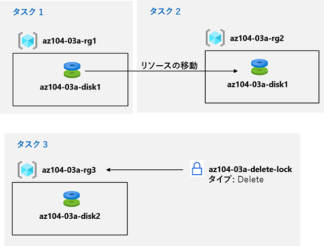

lab:
    title: '03a - Azure portal を使用して Azure リソースを管理する'
    module: 'モジュール 03 - Azure 管理'

# ラボ 03a - Azure portal を使用して Azure リソースを管理する
# 受講生用ラボ マニュアル

## ラボ シナリオ

リソース グループに基づいてリソースをプロビジョニングし、その後リソース グループ間のリソースの移動を実行します。その際、移動が構成に関連してどのような影響を及ぼすのか、基本的な Azureの管理機能を確認します。また、リソースが誤って削除されないように保護するオプションを設定しつつ、リソース構成の更新などが実施できるか確認します。

## 目標

このラボでは次の内容を学習します。

+ タスク 1: リソース グループを作成し、リソース グループにリソースをデプロイする
+ タスク 2: リソース グループ間でリソースを移動する
+ タスク 3: リソース ロックを実装してテストする

## 予想時間: 20 分

## アーキテクチャの図

## 手順

### 演習 1

#### タスク 1: リソース グループを作成し、リソース グループにリソースをデプロイする

このタスクでは、Azure portal を使用してリソース グループを作成し、リソース グループにディスクを作成します。

1. [Azure portal](https://portal.azure.com) にサインインします。

1. Azure portal で、**「ディスク」** を検索して選択し、**「+ 作成」** をクリックして、次の設定を指定します。

    |設定|値|
    |---|---|
    |サブスクリプション| **Azure Pass スポンサー プラン** |
    |リソース グループ(新規作成)| **az104-03a-rg1** |
    |ディスク名| **az104-03a-disk1** |
    |地域| **(US)East US** |
    |可用性ゾーン| **なし** |
    |ソース タイプ| **なし** |
    |サイズ(サイズの変更) ディスクSKU| **Standard HDD** |
    |サイズ(サイズの変更) サイズ| **32GiB** |

1. **「確認および作成」** をクリックし、**「作成」** をクリックします。

    >**注**: ディスクが作成されるまで待ちます。これには 1 分もかかりません。

#### タスク 2: リソース グループ間でリソースを移動する 

このタスクでは、前のタスクで作成したディスク リソースを新しいリソース グループに移動します。 

1. **「リソース グループ」** を検索して選択します。 

1. **「リソース グループ」** ブレードで、前のタスクで作成した **az104-03a-rg1** リソース グループを表すエントリをクリックします。

1. リソース グループの **「概要」 **ブレードで、リソース リストから、作成されたディスクを表すエントリのチェックボックスをクリックし、ツールバーの **「移動」** をクリックし、ドロップダウン リストで、**「別のリソース グループに移動」** を選択します。

    >**注**: この方法により、複数のリソースを同時に移動できます。 

1. 「**リソース グループ**」テキスト ボックスの下にある「**新規作成**」をクリックし、テキスト　ボックスに「**az104-03a-rg2**」と入力し、「OK」をクリックします。「次へ」をクリックし、検証が完了するのを待ちます。 「次へ」がクリック可能になったことを確認し、クリックして「レビュー」タブに移動します。「**移動されたリソースに関連付けられているツールとスクリプトは、新しいリソース ID を使用するように更新するまで動作しないことを理解しました。**」 というチェックボックスを選択し、「**OK**」 をクリックします。

    >**注**: 移動が完了するのを待たず、代わりに次のタスクに進みます。移動には約 10 分かかります。ソースまたはターゲットのリソース グループのアクティビティ ログ エントリを監視することで、操作が完了したことを確認できます。次のタスクを完了したら、この手順を再び確認してください。

#### タスク 3: リソース ロックの実装

このタスクでは、ディスク リソースを含む Azure リソース グループにリソース ロックを適用します。

1. Azure portal で、**「ディスク」** を検索して選択し、**「+ 作成」** をクリックして、次の設定を指定します。

    | 設定                             | 値                               |
    | -------------------------------- | -------------------------------- |
    | サブスクリプション               | **Azure Pass スポンサー プラン** |
    | リソース グループ(新規作成)      | **az104-03a-rg3**                |
    | ディスク名                       | **az104-03a-disk2**              |
    | 地域                             | **(US)East US**                  |
    | 可用性ゾーン                     | **なし**                         |
    | ソース タイプ                    | **なし**                         |
    | サイズ(サイズの変更) ディスクSKU | **Standard HDD**                 |
    | サイズ(サイズの変更) サイズ      | **32GiB**                        |

1. **「確認および作成」** をクリックし、**「作成」** をクリックします。

1. 「リソースに移動」 をクリックします。 

1. **「az104-03a-rg3** リソース グループ」 ブレードで、**「ロック」** をクリックしてから、**「+ 追加」** をクリックして、次の設定を指定します。

    |設定|値|
    |---|---|
    |ロック名| **az104-03a-delete-lock** |
    |ロックのタイプ| **削除** |
    
1. 「**OK**」 をクリックします    

1. **az104-03a-rg3** リソース グループの**「概要」**ブレードで、リソースリストから前のタスクで作成したディスクを表すエントリを選択し、ツールバーの **「削除」** をクリックします。 

1. **「選択したリソースをすべて削除しますか?」**というメッセージが表示されたら、**「削除の確認」** テキスト ボックスに「**はい**」と入力し、**「削除」** をクリックします。

1. 削除操作の失敗を通知するエラー メッセージが表示されます。 

    >**注**: エラー メッセージが表示される場合、これは、リソース グループ レベルに適用された削除ロックが原因であると予想されます。

1. **az104-03a-rg3** リソース グループのリソースのリストに戻り、**az104-03a-disk2** リソースを表すエントリをクリックします。 

1. **az104-03a-disk2** ブレードの 「**設定**」 セクションで 「**サイズおよびパフォーマンス**」 をクリックし、次の設定を指定します。

    | 設定                             | 値              |
    | -------------------------------- | --------------- |
    | サイズ(サイズの変更) ディスクSKU | **Premium SSD** |
    | サイズ(サイズの変更) サイズ      | **64GiB**       |
    
1. 「**サイズ変更**」 をクリックして、変更を適用します。変更が成功したことを確認します。

    >**注**: リソース グループ レベルのロックは削除操作にのみ適用されるため、これは予想されることです。 

#### リソースをクリーン アップする

   >**注**: このラボでデプロイしたリソースは削除しないでください。このモジュールの次のラボで、これらを使用します。このラボで作成したリソース ロックのみを削除します。

1. **az104-03a-rg3** リソース グループ ブレードに移動し、**「ロック」** ブレードを表示し、**「削除」** ロック エントリの右側にある **「削除」** リンクをクリックして **az104-03a-delete-lock** のロックを削除します。

#### レビュー

このラボでは次の内容を学習しました。

- リソース グループを作成し、リソース グループにリソースをデプロイしました
- リソース グループ間でリソースを移動しました
- リソース ロックを実装およびテストしました
