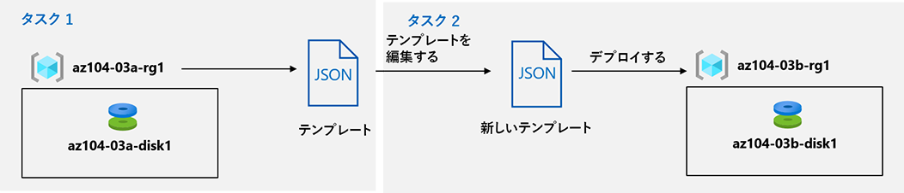

---
lab:
    title: '03b - ARM テンプレートを使用して Azure リソースを管理する'
    module: 'モジュール 03 - Azure 管理'
---

# ラボ 03b - ARM テンプレートを使用して Azure リソースを管理する
# 学生用ラボ マニュアル

## ラボ シナリオ
直前のラボではAzure portal を使用して、リソースのプロビジョニングとリソース グループに基づく構成に関連する基本的な Azure 管理機能を確認しました。次は、Azure Resource Manager テンプレートを使用して同等のタスクを実行します。

## 目標

このラボでは次の内容を学習します。

+ タスク 1: Azure マネージド ディスクのデプロイのために ARM テンプレートを確認する
+ タスク 2: ARM テンプレートを使用して、Azure マネージド ディスクを作成する
+ タスク 3: ARM テンプレートベースでデプロイしたマネージド ディスクを確認する

## 予想時間: 20 分

## アーキテクチャの図



## 指示

### 演習 1

#### タスク 1: Azure マネージド ディスクのデプロイのために ARM テンプレートを確認する

このタスクでは、Azure Resource Manager テンプレートを使用して Azure ディスク リソースを作成します。

1. [**Azure portal**](https://portal.azure.com) にサインインします。

1. Azure portalで、**「リソース グループ」** を検索して選択します。 

1. リソース グループのリストで、**az104-03a-rg1** をクリックします。

1. **az104-03a-rg1** リソース グループ ブレードの **「設定」** セクションで、**「デプロイ」** をクリックします。

1. **az104-03a-rg1 - デプロイ** ブレードで、デプロイの一覧の最初のエントリをクリックします。

1. **Microsoft.ManagedDisk-*XXXXXXXXX* \| 概要** ブレードで、「**テンプレート**」 をクリックします。

1. 「**デプロイ**」をクリックします。

    

#### タスク 2: ARM テンプレートを使用して、Azure マネージド ディスクを作成する

1. 「**テンプレートの編集**」 をクリックし、エディター ウィンドウで、次の行を削除します。

    ```json
    "sourceResourceId": {
        "type": "String"
    },
    "sourceUri": {
        "type": "String"
    },
    "osType": {
        "type": "String"
    },
    ```

    ```json
    "hyperVGeneration": {
        "defaultValue": "V1",
        "type": "String"
    },      
    ```

    ```json
    "osType": "[parameters('osType')]",
    ```

     >**注**: 削除前に、上記パラメータがない場合があります。その場合は、そのまま手順を進めてください。

1. 「**保存**」をクリックして、変更を適用します。

1. **「カスタム デプロイ」** ブレードに戻って、次の設定を指定します。

    | 設定 | 値 |
    | --- |--- |
    | サブスクリプション | **Azure Pass スポンサー プラン** |
    | リソース グループ(新規作成) | **az104-03b-rg1** |
    | リージョン | **East US** |
    | Disk Name | **az104-03b-disk1** |
    | location | **eastus** |
    | Sku | **Standard_LRS** |
    | Disk Size Gb | **32** |
    | Create Option | **empty** |
    | Disk Encryption Set Type | **EncryptionAtRestWithPlatformKey** |
    | Network Access Policy | **AllowAll** |

    > **注**:リソースグループやディスク名を"03b"に変更したことを確認してください。
    >
    > 　 前のタスクで作成した名前は"03a"です。

1. 「**確認と作成**」を選択し、「**作成**」を選択します。

1. デプロイが正常に完了したことを確認します。

#### タスク 3: マネージド ディスクの ARM テンプレートベースのデプロイを確認する

1. Azure portalで、**「リソース グループ」** を検索して選択します。 

1. リソース グループのリストで、**az104-03b-rg1** をクリックします。

1. **az104-03b-rg1** リソース グループ ブレードの **「設定」** セクションで、**「デプロイ」** をクリックします。

1. **「az104-03b-rg1 - デプロイ」** ブレードから、デプロイのリストの最初のエントリをクリックし、**「入力」** ブレードと **「テンプレート」** ブレードの内容を確認します。

#### リソースをクリーン アップする

   >**注**: このラボでデプロイしたリソースは削除しないでください。このモジュールの次のラボで、それらを参照します。

#### レビュー

このラボでは次の内容を学習しました。

- Azure マネージド ディスクのデプロイに関する ARM テンプレートを確認しました
- ARM テンプレートを使用して Azure マネージド ディスクを作成しました
- マネージド ディスクの ARM テンプレートベースのデプロイを確認しました
