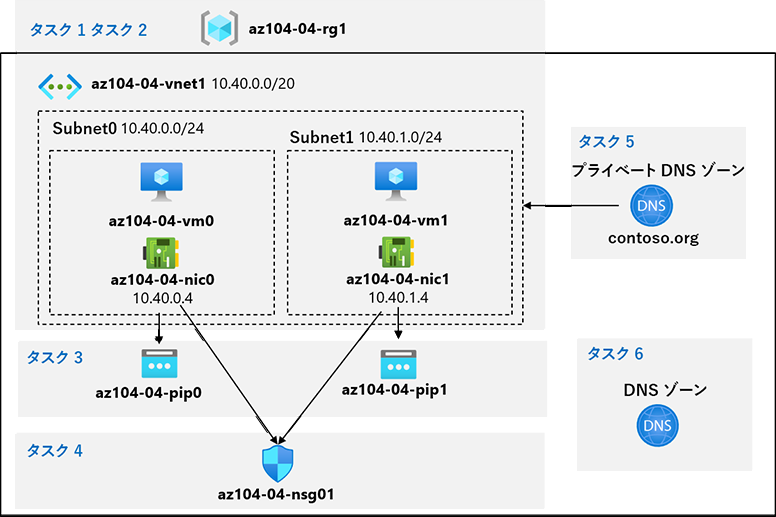

lab:
    title: '04 - 仮想ネットワークを実装する'
    module: 'モジュール 04 – バーチャル ネットワーク'

# ラボ 04 - 仮想ネットワークを実装する

# 受講生用ラボ マニュアル

## ラボ シナリオ

Azure 仮想ネットワークの機能について学習します。まず、Azure でいくつかの仮想マシンをホストする仮想ネットワークを構成します。ネットワーク ベースのセグメンテーションを実装するため、仮想マシンは仮想ネットワーク内の異なるサブネットにデプロイします。また、プライベート IP アドレスとパブリック IP アドレスが変更されないようにする必要もあります。Contoso のセキュリティ要件に準拠するには、インターネットからアクセスできる Azure 仮想マシンのパブリック エンドポイントを保護する必要があります。最後に、仮想ネットワーク内とインターネットからの両方で、DNSによる仮想マシンの名前解決を実装する必要があります。

## 目標

このラボでは次の内容を学習します。

+ タスク 1: 仮想ネットワークを作成および構成する
+ タスク 2: 仮想マシンを仮想ネットワークにデプロイする
+ タスク 3: Azure VM のプライベート IP アドレスとパブリック IP アドレスを構成する
+ タスク 4: ネットワーク セキュリティ グループを構成する
+ タスク 5: 内部の名前解決に Azure DNS を構成する
+ タスク 6: 外部の名前解決に Azure DNS を構成する

## 推定時間: 40 分

## アーキテクチャの図



## 手順

### 演習 1

#### タスク 1: 仮想ネットワークを作成および構成する

このタスクでは、Azure portal を使用して、複数のサブネットを持つ仮想ネットワークを作成します。

1. [Azure Portal](https://portal.azure.com) にサインインします。

1. Azure portal で、**「仮想ネットワーク」** を検索して選択し、**「仮想ネットワーク」** ブレードで **「+ 作成」** をクリックします。

1. 仮想ネットワークを次の設定で作成します (その他の設定は既定値のままにします)。

    | 設定 | 値 |
    | --- | --- |
    | サブスクリプション | **Azure Pass スポンサー プラン** |
    | リソース グループ(新規作成) | **az104-04-rg1** |
    | 名前 | **az104-04-vnet1** |
    | 地域 | **East US** |

1. **「次 : IP アドレス」** をクリックして、次の値を入力します

    | 設定 | 値 |
    | --- | --- |
    | IPv4 アドレス空間 | **10.40.0.0/20** |

1. **「+ サブネットの追加」** をクリックして、次の値を入力してから、**「追加」** をクリックします

    | 設定 | 値 |
    | --- | --- |
    | サブネット名 | **subnet0** |
    | サブネット アドレス範囲 | **10.40.0.0/24** |

1. 既定値をそのまま使用し、**「確認および作成」** をクリックします。その後、 **「作成」** をクリックしてデプロイを送信します。

    >**注:** 仮想ネットワークがプロビジョニングされるのを待ちます。通常は 1 分もかかりません。

1. **「リソースに移動」** をクリックします

1. **「az104-04-vnet1** 仮想ネットワーク」ブレードで、**「サブネット」** をクリックし、**「+ サブネット」** をクリックします。

1. サブネットを次の設定で作成します (その他の設定は既定値のままにします)。

    | 設定 | 値 |
    | --- | --- |
    | 名前 | **subnet1** |
    | アドレス範囲 (CIDR ブロック) | **10.40.1.0/24** |
    | NATゲートウェイ | **None** |
    | サービスエンドポイント | **None** |

1. サブネットの設定が完了したら、「**追加**」をクリックします

1. 「**確認および作成**」をクリックし、検証に成功したのを確認して「**作成**」をクリックします。

#### タスク 2: 仮想マシンを仮想ネットワークにデプロイする

このタスクでは、ARM テンプレートを使用して、Azure 仮想マシンを仮想ネットワークの異なるサブネットにデプロイします。

1. Azure portal の右上にあるアイコンをクリックして **Azure Cloud Shell** を開きます。

1. **Bash** や **PowerShell** のどちらかを選択するためのプロンプトが表示されたら、**PowerShell** を選択します。

    > **注**: **Cloud Shell** の初回起動時に **「ストレージがマウントされていません」** というメッセージが表示された場合は、このラボで使用しているサブスクリプションを選択し、**「ストレージの作成」** を選択します。

1. Cloud Shell ウィンドウのツールバーで、**「ファイルのアップロード/ダウンロード」** アイコンをクリックし、ドロップダウン メニューで **「アップロード」** をクリックして、以下のファイルをファイルをCloud Shell ホーム ディレクトリにアップロードします。

    　　**\Allfiles\Labs\04\az104-04-vms-loop-template.json** 

    　　**\Allfiles\Labs\04\az104-04-vms-loop-parameters.json** 

1. 「Cloud Shell」 ウィンドウで次のコマンドを実行して、アップロードしたテンプレートとパラメーター ファイルを使用して 2 つの仮想マシンをデプロイします。

    ```powershell
    $rgName = 'az104-04-rg1'
    
    New-AzResourceGroupDeployment `
       -ResourceGroupName $rgName `
       -TemplateFile $HOME/az104-04-vms-loop-template.json `
       -TemplateParameterFile $HOME/az104-04-vms-loop-parameters.json
    ```

     >**注**: デプロイが完了するまで待機します。次のタスクではここでデプロイした仮想マシンを使用します。これにはおよそ 2 分かかります。

1. 「Cloud Shell」 ペインを閉じます。

#### タスク 3: Azure VM のプライベート IP アドレスとパブリック IP アドレスを構成する

このタスクでは、Azure 仮想マシンのネットワーク インターフェイスに割り当てられたパブリック IP アドレスとプライベート IP アドレスの静的割り当てを構成します。

   >**注**: プライベート IP アドレスとパブリック IP アドレスは、実際にネットワーク インターフェイスに割り当てられ、次に Azure 仮想マシンに接続されますが、Azure VM に割り当てられた IP アドレスを代わりに参照することもよくあります。

1. Azure portal で **「リソース グループ」** を検索して選択し、**「リソース グループ」** ブレードで **「az104-04-rg1」** をクリックします。

2. **「az104-04-rg1** リソース グループ」 ブレードのリソースのリストで、「**az104-04-vnet1」** をクリックします。

3. **「az104-04-vnet1** バーチャル ネットワーク」 ブレードで、**「接続デバイス」** セクションを確認し、バーチャル ネットワークに接続されている 2 つのネットワーク インターフェイス **az104-04-nic0** と **az104-04-nic1** があることを確認します。

4. **「az104-04-nic0」** をクリックし、**「az104-04-nic0」** ブレードで「**設定**」セクションの **「IP 構成」** をクリックします。

5. IP 構成のリストで、**「ipconfig1」** をクリックします。

6. **ipconfig1** ブレードの **「パブリック IP アドレス設定」** セクションで、**「関連付け」** を選択し、**「+ 新規作成」** をクリックして、次の設定を指定し、**「OK」** をクリックします。

   | 設定 | 値                |
   | ---- | ----------------- |
   | 名前 | **az104-04-pip0** |
   | SKU  | **Standard**      |

7.  **「ipconfig1」** ブレードの **「プライベートIP アドレス設定」** セクションで、デフォルトの設定では**「割り当て」** が「**動的**」になっていることを確認します。IPアドレスを固定するため、 **「静的」** に設定を変更し、**「IP アドレス」** の既定値を **10.40.0.4** のままにします。

8. **「保存」** をクリックして、変更を保存します。次の手順に進む前に、必ず保存操作が完了するまで待ちます。

9. **「az104-04-vnet1」** ブレードに戻ります。

10. **「az104-04-nic1」** をクリックし、**「az104-04-nic1」** ブレードで **「IP 構成」** をクリックします。**「az104-04-nic0」**と同じ構成変更を実施します。

11. IP 構成のリストで、**「ipconfig1」** をクリックします。

12. **ipconfig1** ブレードの **「パブリック IP アドレス設定」** セクションで、**「関連付け」** を選択し、**「+ 新規作成」** をクリックして、次の設定を指定し、**「OK」** をクリックします。

    | 設定 | 値                |
    | ---- | ----------------- |
    | 名前 | **az104-04-pip1** |
    | SKU  | **Standard**      |

13. **「ipconfig1」** ブレードの **「プライベートIP アドレス設定」** セクションで、**「割り当て」** を **「静的」** に設定し、**「IP アドレス」** の既定値を **10.40.1.4** のままにします。

14. **「保存」** をクリックして、変更を保存します。次の手順に進む前に、必ず保存操作が完了するのを待ってください。

15. **「az104-04-rg1** リソース グループ」 ブレードに戻り、そのリソースのリストで **「az104-04-vm0」** をクリックし、**「az104-04-vm0** 仮想マシン」 ブレードでパブリック IP アドレスのエントリをメモします。

16. **「az104-04-rg1** リソース グループ」 ブレードに戻り、そのリソースのリストで **「az104-04-vm1」** をクリックし、**「az104-04-vm1** 仮想マシン」 ブレードでパブリック IP アドレスのエントリをメモします。

    > **注**: このラボの最後のタスクで、両方の IP アドレスが必要になります。

#### タスク 4: ネットワーク セキュリティ グループを構成する

このタスクでは、Azure 仮想マシンへの接続を制限できるように、ネットワーク セキュリティ グループを構成します。

1. Azure portal で 「**az104-04-rg1** リソース グループ」 ブレードに戻り、リソースのリストから 「**az104-04-vm0**」 をクリックします。

1. 「**az104-04-vm0 概要**」 ブレードで、「**接続**」 をクリックし、ドロップダウン メニューで 「**RDP**」 をクリックします。「**RDPで接続する**」 ブレードで 「**RDP ファイルのダウンロード**」 をクリックし、RDPファイルを実行してプロンプトに従ってリモート デスクトップ セッションを開始します。

1. 接続の成否を確認します。この段階では接続に失敗するはずです。

    >**注**:失敗することは想定されています。既定では、Standard SKU のパブリック IP アドレスが割り当てられているネットワーク インターフェイスは、ネットワーク セキュリティ グループによる保護されている必要があるためです。リモート デスクトップ接続を許可するには、インターネットからの受信 RDP トラフィックを明示的に許可するネットワーク セキュリティ グループを作成し、仮想マシンのネットワーク インターフェイスに割り当てます。

1. Azure portal で 「**ネットワーク セキュリティ グループ**」 を検索して選択し、「**ネットワーク セキュリティ グループ**」 ブレードで 「**+ 作成**」 をクリックします。

1. ネットワーク セキュリティ グループを次の設定で作成します (その他の設定は既定値のままにします)。

    | 設定 | 値 |
    | --- | --- |
    | サブスクリプション | **Azure Pass スポンサー プラン** |
    | リソース グループ | **az104-04-rg1** |
    | 名前 | **az104-04-nsg01** |
    | 地域 | **East US** |

1. 「**確認および作成**」 をクリックします。検証の成功を確認し、「**作成**」 をクリックしてデプロイを実行します。

    >**注**: デプロイが完了するのを待ちます。これにはおよそ 2 分かかります。

1. 「デプロイ」 ブレードで 「**リソースに移動**」 をクリックして、「**az104-04-nsg01** ネットワーク セキュリティ グループ」 ブレードを開きます。

1. 「**az104-04-nsg01** ネットワーク セキュリティ グループ」 ブレードの 「**設定**」 セクションで、「**受信セキュリティ ルール**」 をクリックします。

1. 次の設定を使用して受信ルールを追加します (その他の設定は既定値のままにします)。

    | 設定 | 値 |
    | --- | --- |
    | ソース | **Any** |
    | ソース ポート範囲 | * |
    | 宛先 | **Any** |
    | サービス | **RDP** |
    | アクション | **許可** |
    | 優先度 | **300** |
    | 名前 | **AllowRDPInBound** |

1. **「az104-04-nsg01** ネットワーク セキュリティ グループ」 ブレードの **「設定」** セクションで、**「ネットワーク インターフェイス」** をクリックし、**「関連付け」** をクリックします。

1. 作成したNSG「**az104-04-nsg01**」 をネットワークインターフェース**「az104-04-nic0**」 および 「**az104-04-nic1**」 に関連付けます。

      > **注**: ネットワーク セキュリティ グループのルールがネットワーク インターフェイス カードに適用されるまで、最大 5 分かかる場合があります。

1. 仮想マシン**「az104-04-vm0**」のブレードに戻ります。

1. **「az104-04-vm0」** ブレードで、**「接続」** のプルダウンメニューから**「RDP」** をクリック。**「RDP で接続する」** から**「RDP ファイルのダウンロード」** をクリックし、ダウンロードされたRDPファイルを実行してプロンプトに従ってリモート デスクトップ セッションを開始します。

      > **注**: この手順では、Windows コンピューターからリモート デスクトップ経由で接続することを指します。Mac ではMac App Store からリモート デスクトップ クライアントを、Linux コンピューターではオープンソースの RDP クライアント ソフトウェアを使用できます。

      > **注**: ターゲット仮想マシンに接続する際は、警告メッセージを無視して進めます。

1. 資格情報の入力プロンプトが表示されたら、ユーザー名：**Student**、パスワード： **Pa55w.rd1234**を使用してサインインします。

      > **注**: 接続したリモート デスクトップ セッションは閉じずに最小化します。これは次のタスクで必要になります。

#### タスク 5: 内部の名前解決に Azure DNS を構成する

このタスクでは、Azure プライベート DNS ゾーンを使用して、仮想ネットワーク内での DNS 名前解決を構成します。

1. Azure portal で、「**プライベート DNS ゾーン**」 を検索して選択し、「**プライベート DNS ゾーン**」 ブレードで 「**+ 作成**」 をクリックします。

1. プライベート DNS ゾーンを次の設定で作成します (その他の設定は既定値のままにします)。

    | 設定 | 値 |
    | --- | --- |
    | サブスクリプション | **Azure Pass スポンサー プラン** |
    | リソース グループ | **az104-04-rg1** |
    | 名前 | **contoso.org** |

1. 「**確認および作成**」をクリックします。検証を実行し、「**作成**」をクリックしてデプロイを送信します。

    >**注**: プライベート DNS ゾーンが作成されるのを待ちます。これにはおよそ 2 分かかります。

1. 「**リソースに移動**」 をクリックして 「**contoso.org \| DNS プライベート ゾーン**」 ブレードを開きます。

1. 「**contoso.org \| プライベート DNS ゾーン**」ブレードの **「設定」** セクションで、**「仮想ネットワーク リンク」** をクリックします。

1. **「+ 追加」** をクリックして、仮想ネットワーク リンクを次の設定で作成します (他の設定は既定値のままにします)。

    | 設定 | 値 |
    | --- | --- |
    | リンク名 | **az104-04-vnet1-link** |
    | サブスクリプション | **Azure Pass スポンサー プラン** |
    | 仮想ネットワーク | **az104-04-vnet1** |
    | 自動登録を有効にする | **enabled(チェックボックスにチェックを入れる)** |

1. **「OK」** をクリックします。

    >**注:** 仮想ネットワーク リンクが作成されるまで待ちます。通常は 1 分もかかりません。

1. **「contoso.org** プライベート DNS ゾーン」ブレードのサイドバーで、**「概要」** をクリックします。

1. **az104-04-vm0** および **az104-04-vm1** の DNS レコードが、レコード セットのリストに**自動登録**として表示されることを確認 します。

    >**注:** レコード セットが表示されない場合は、数分待ってからページを更新する必要があります。

1. リモート デスクトップ セッションを **az104-04-vm0** に切り替えて、「**スタート**」 ボタンを右クリックし、右クリック メニューで、「**Windows PowerShell (管理者)**」 をクリックします。

1. Windows PowerShell コンソール ウィンドウで次のコマンドを実行して、新しく作成したプライベート DNS ゾーン内の内部名前解決をテストします。

   ```powershell
   nslookup az104-04-vm0.contoso.org
   nslookup az104-04-vm1.contoso.org
   ```

1. コマンドの出力に、**az104-04-vm1** (**10.40.1.4**) のプライベート IP アドレスが含まれていることを確認します。

#### タスク 6: 外部の名前解決に Azure DNS を構成する

このタスクでは、Azure パブリック DNS ゾーンを使用して外部 DNS 名前解決を構成します。

1. **SEA-DEV** ラボ システムの Web ブラウザーで新しいタブを開き、https://www.godaddy.com/domains/domain-name-search に移動します。

2. ドメイン名検索を使用して、使用されていないドメイン名を識別します。

   > 注：ドメインを購入する必要はありません。
   >
   > 注：悩んだ場合は ctc####.com (####は自身のアカウント番号4桁の数字)を選んでください。
   >
   > 　　例：ctc0000.com

3. Azure portal で **「DNS ゾーン」** を検索して選択し、**「DNS ゾーン」** ブレードで **「+ 追加」** をクリックします。

4. DNS ゾーンを次の設定で作成します (その他の設定は既定値のままにします)。

   | 設定               | 値                                                           |
   | ------------------ | ------------------------------------------------------------ |
   | サブスクリプション | **Azure Pass スポンサー プラン**                             |
   | リソース グループ  | **az104-04-rg1**                                             |
   | 名前               | **手順2で確認した使用していないドメイン名を入力(例：ctc0000.com)** |

5. 「**確認および作成**」 をクリックします。検証を実行し、「**作成**」 をクリックしてデプロイを実行します。

   > **注**: DNS ゾーンが作成されるのを待ちます。これにはおよそ 2 分かかります。

6. 「**リソースに移動**」 をクリックして、新しく作成した DNS ゾーンのブレードを開きます。

7. 「DNS ゾーン」 ブレードで、「**+ レコード セット**」 をクリックします。

8. レコード セットを次の設定で追加します (その他の設定は既定値のままにします)。

   | 設定        | 値                                       |
   | ----------- | ---------------------------------------- |
   | 名前        | **az104-04-vm0**                         |
   | 種類        | **A**                                    |
   | TTL         | **1**                                    |
   | TTL の単位  | **時間**                                 |
   | IP アドレス | **az104-04-vm0のパブリック IP アドレス** |
   
9. 「**OK**」 をクリックします

10. 「DNS ゾーン」 ブレードで、「**+ レコード セット**」 をクリックします。

11. レコード セットを次の設定で追加します (その他の設定は既定値のままにします)。

    | 設定        | 値                                        |
    | ----------- | ----------------------------------------- |
    | 名前        | **az104-04-vm1**                          |
    | 種類        | **A**                                     |
    | TTL         | **1**                                     |
    | TTL の単位  | **時間**                                  |
    | IP アドレス | **az104-04-vm1** のパブリック IP アドレス |
    
12. 「**OK**」 をクリックします

13. 「DNS ゾーン」 ブレードで、「**ネーム サーバー 1**」 のエントリの名前をメモします。

14. Azure portal で、右上にあるアイコンをクリックして、**「Cloud Shell」** の **「PowerShell」** セッションを開きます。

15. 「Cloud Shell」ペインで次のコマンドを実行して、新しく作成した DNS ゾーンに設定されている **「az104-04-vm0」** DNS レコード セットの名前解決をテストします (プレースホルダー `[Name server 1]` をこのタスクで前にメモした **ネーム サーバー 1** の名前に、プレースホルダー `[domain name]` をこのタスクで前に作成した DNS ドメイン名に置き換えます)。

    ```powershell
    nslookup az104-04-vm0.[domain name] [Name server 1]
    ```

16. コマンドの出力に、**az104-04-vm0** のパブリック IP アドレスが含まれていることを確認します。

17. 「Cloud Shell」ペインで次のコマンドを実行して、 新しく作成した DNS ゾーンに設定されている「**az104-04-vm1**」 DNS レコード セットの名前解決をテストします (プレースホルダー `[Name server 1]` をこのタスクで前にメモした **ネーム サーバー 1** の名前に、プレースホルダー `[domain name]` をこのタスクで前に作成した DNS ドメインに置き換えます)。

    ```powershell
    nslookup az104-04-vm1.[domain name] [Name server 1]
    ```

18. コマンドの出力に、**az104-04-vm1** のパブリック IP アドレスが含まれていることを確認します。

#### リソースをクリーン アップする

   >**注**: 新しく作成した Azure リソースのうち、使用しないリソースは必ず削除してください。使用しないリソースを削除し、予期しないコストが発生しないようにします。

1. Azure portal の **「Cloud Shell」** ウィンドウで **「PowerShell」** セッションを開きます。

1. 次のコマンドを実行して、このモジュールのラボ全体で作成したすべてのリソース グループのリストを表示します。

   ```powershell
   Get-AzResourceGroup -Name 'az104-04*'
   ```

1. 次のコマンドを実行して、このモジュールのラボ全体で作成したすべてのリソース グループのリストを削除します。

   ```powershell
   Get-AzResourceGroup -Name 'az104-04*' | Remove-AzResourceGroup -Force -AsJob
   ```

    >**注**: コマンドは非同期で実行されるので (-AsJob パラメーターによって決定されます)、別の PowerShell コマンドを同一 PowerShell セッション内ですぐに実行できますが、リソース グループが実際に削除されるまでに数分かかります。

#### 確認

このラボでは次の内容を学習しました。

+ 仮想ネットワークを作成して構成しました
+ 仮想マシンを仮想ネットワークにデプロイしました
+ Azure VM のプライベート IP アドレスとパブリック IP アドレスを構成しました
+ ネットワーク セキュリティ グループを構成しました
+ Azure DNS を内部の名前解決用に構成しました
+ Azure DNS を外部の名前解決用に構成しました
