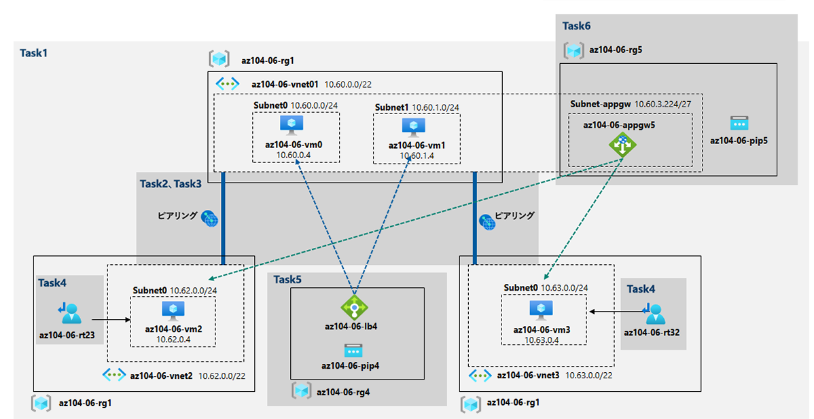

---
lab:
    title: '06 - トラフィック管理を実装する'
    module: 'モジュール 06 - ネットワーク トラフィック管理'
---

# ラボ 06 - トラフィック管理を実装する
# 受講生用ラボ マニュアル

## ラボ シナリオ

ハブおよびスポーク ネットワーク トポロジの Azure 仮想マシンを対象としたネットワーク トラフィックの管理テストを担当していましたが、Contoso は Azure 環境での実装を検討しています (前のラボでテストしたメッシュ トポロジを作成する代わりに)。このテストでは、ハブを経由してトラフィックを強制的に流すユーザー定義ルートに依存してスポーク間の接続を実装する必要があり、また、レイヤ 4 およびレイヤ 7 ロード バランサーを使用して仮想マシン間でのトラフィック分散を行う必要があります。この目的のために、Azure Load Balancer (レイヤ 4) と Azure Application Gateway (レイヤ 7) を使用する予定です。

>**注**: このラボでは、デフォルトで、Standard_D2s_v3 SKU の Azure VM のデプロイが 4 つ含まれるため、デプロイ用に選択したリージョンの Standard_Dsv3 シリーズで使用可能な vCPU が合計 8 個必要です。受講生が試用版アカウントを使用しており、vCPU が 4 つに制限されている場合は、1 つの vCPU のみを必要とする VM サイズ (Standard_B1s など) を使用できます。

## 目標

このラボでは次の内容を学習します。

+ タスク 1: ラボ環境をプロビジョニングする
+ タスク 2: ハブとスポークのネットワーク トポロジを構成する
+ タスク 3: 仮想ネットワーク ピアリングの推移性をテストする
+ タスク 4: ハブとスポークのトポロジのルーティングを構成する
+ タスク 5: Azure Load Balancer を実装する
+ タスク 6: Azure Application Gateway を実装する

## 推定時間: 60 分

## アーキテクチャの図




## 手順

### 演習 1

#### タスク 1: ラボ環境をプロビジョニングする

このタスクでは、同じ Azure リージョンに 4 つの仮想マシンをデプロイします。最初の 2 つはハブ仮想ネットワークに存在し、残りはそれぞれ別個のスポーク仮想ネットワークに存在します。

1. [Azure portal](https://portal.azure.com/) にサインインします。

1. Azure portal の右上にあるアイコンをクリックして **Azure Cloud Shell** を開きます。

1. **Bash** や **PowerShell** のどちらかを選択するためのプロンプトが表示されたら、**PowerShell** を選択します。

    > **注**: **Cloud Shell** の初回起動時に **「ストレージがマウントされていません」** というメッセージが表示された場合は、このラボで使用しているサブスクリプションを選択し、**「ストレージの作成」** を選択します。

1. Cloud Shell ウィンドウのツールバーで、**「ファイルのアップロード/ダウンロード」** アイコンをクリックし、ドロップダウン メニューで 

    **「アップロード」** をクリックして、以下のファイルをファイルをCloud Shell ホーム ディレクトリにアップロードします。

    　　　**\Allfiles\Labs\06\az104-06-vms-loop-template.json** 

    　　　 **\Allfiles\Labs\06\az104-06-vms-loop-parameters.json**

1. 「Cloud Shell」 ペインから次を実行して、ラボ環境をホストする最初のリソース グループを作成します。

    ```powershell
    $location = 'eastus'
    
    $rgName = 'az104-06-rg1'
    
    New-AzResourceGroup -Name $rgName -Location $location
    ```

1. 「Cloud Shell」 ウィンドウで、次のコマンドを実行して 3 つの仮想ネットワークを作成し、アップロードしたテンプレートとパラメーター ファイルを使用して、4 つの Azure VM を作成します。

    ```powershell
    New-AzResourceGroupDeployment `
       -ResourceGroupName $rgName `
       -TemplateFile $HOME/az104-06-vms-loop-template.json `
       -TemplateParameterFile $HOME/az104-06-vms-loop-parameters.json
    ```

1. Cloud Shell ウィンドウから、以下を実行して、前の手順でデプロイされた Azure VM に Network Watcher 拡張機能をインストールします。

    ```powershell
    $rgName = 'az104-06-rg1'
    $location = (Get-AzResourceGroup -ResourceGroupName $rgName).location
    $vmNames = (Get-AzVM -ResourceGroupName $rgName).Name
    
    foreach ($vmName in $vmNames) {
      Set-AzVMExtension `
      -ResourceGroupName $rgName `
      -Location $location `
      -VMName $vmName `
      -Name 'networkWatcherAgent' `
      -Publisher 'Microsoft.Azure.NetworkWatcher' `
      -Type 'NetworkWatcherAgentWindows' `
      -TypeHandlerVersion '1.4'
    }
    ```

1. 設定完了後、「Cloud Shell」 ペインを閉じます。

#### タスク 2: ハブとスポークのネットワーク トポロジを構成する

このタスクでは、前のタスクで展開した仮想ネットワーク間のローカル ピアリングを構成して、ハブとスポークのネットワーク トポロジを作成します。

1. Azure portal で、**「仮想ネットワーク」** を検索して選択します。

1. 前のタスクで作成した仮想ネットワークを確認します。

    >**注**: 3 つの仮想ネットワークのデプロイに使用したテンプレートに、3 つの仮想ネットワークの IP アドレス範囲が重複しないようにします。

1. 仮想ネットワークのリストで、**「az104-06-vnet2」** を選択します。

1. 「**az104-06-vnet2**」 ブレードで「**プロパティ**」を選択します。 

1. 「**az104-06-vnet2 \| プロパティ**」ブレードで、「**リソース ID**」プロパティの値を記録します。

1. 仮想ネットワークのリストに戻り、**「az104-06-vnet3」** を選択します。

1. 「**az104-06-vnet3**」ブレードで「**プロパティ**」を選択します。 

1. 「**az104-06-vnet3 \| プロパティ**」ブレードで、「**リソース ID**」プロパティの値を記録します。

    >**注**: このタスクの後半で、両方の仮想ネットワークの ResourceID プロパティの値が必要になります。

    >**注**: これは、仮想ネットワーク ピアリングを作成するときに、Azure Portal が新しくプロビジョニングされた仮想ネットワークを表示しないことがあるという問題に対処する回避策です。

1. 仮想ネットワークのリストで、**「az104-06-vnet01」** をクリックします。

1. **「az104-06-vnet01** 仮想ネットワーク」ブレードの **「設定」** セクションで **「ピアリング」** をクリックしてから、**「+ 追加」** をクリックします。

1. 次の設定でピアリングを追加し (他のユーザーには既定値を残します)、**「追加」** をクリックします。

     | 設定                                                         | 値                                                           |
     | ------------------------------------------------------------ | ------------------------------------------------------------ |
     | **この仮想ネットワーク**：ピアリング リンク名                | **az104-06-vnet01_to_az104-06-vnet2**                        |
     | **この仮想ネットワーク**：リモート仮想ネットワークへのトラフィック | **許可（規定）**                                             |
     | **この仮想ネットワーク**：リモート仮想ネットワークから転送されたトラフィック | **この仮想ネットワークの外部から来ているトラフィックをブロックする** |
     | **この仮想ネットワーク**：仮想ネットワーク ゲートウェイまたはルート サーバー | **なし**                                                     |
     | **リモート仮想ネットワーク**：ピアリング リンク名            | **az104-06-vnet2_to_az104-06-vnet01**                        |
     | **リモート仮想ネットワーク**：仮想ネットワークのデプロイ モデル | **Resource Manager**                                         |
     | リソース ID を知っている                                     | **チェックボックスにチェックを入れる**                       |
     | リソース ID                                                  | このタスクの前半で記録した **az104-06-vnet2** のリソースID   |
     | リモート 仮想ネットワークのトラフィック                      | **許可 (既定)**                                              |
     | リモート 仮想ネットワークから転送されたトラフィック          | **許可 (既定)**                                              |
     | 仮想ネットワーク ゲートウェイ                                | **なし (既定)**                                              |

     >**注**: 操作が完了するまで待ちます。

     >**注**: この手順では、az104-06-vnet01 から az104-06-vnet2、az104-06-vnet2 から az104-06-vnet01 までの 2 つのローカル ピアリングを確立します。

1. **「az104-06-vnet01** 仮想ネットワーク」ブレードの **「設定」** セクションで **「ピアリング」** をクリックしてから、**「+ 追加」** をクリックします。

1. 次の設定でピアリングを追加し (他のユーザーには既定値を残します)、**「追加」** をクリックします。

    | 設定                                                         | 値                                                           |
    | ------------------------------------------------------------ | ------------------------------------------------------------ |
    | **この仮想ネットワーク**：ピアリング リンク名                | **az104-06-vnet01_to_az104-06-vnet3**                        |
    | **この仮想ネットワーク**：リモート仮想ネットワークへのトラフィック | **許可（規定）**                                             |
    | **この仮想ネットワーク**：リモート仮想ネットワークから転送されたトラフィック | **この仮想ネットワークの外部から来ているトラフィックをブロックする** |
    | **この仮想ネットワーク**：仮想ネットワーク ゲートウェイまたはルート サーバー | **なし**                                                     |
    | **リモート仮想ネットワーク**：ピアリング リンク名            | **az104-06-vnet3_to_az104-06-vnet01**                        |
    | **リモート仮想ネットワーク**：仮想ネットワークのデプロイ モデル | **Resource Manager**                                         |
    | リソース ID を知っている                                     | **チェックボックスにチェックを入れる**                       |
    | リソース ID                                                  | このタスクの前半で記録した **az104-06-vnet3** のリソースID   |
    | リモート 仮想ネットワークのトラフィック                      | **許可 (既定)**                                              |
    | リモート 仮想ネットワークから転送されたトラフィック          | **許可 (既定)**                                              |
    | 仮想ネットワーク ゲートウェイ                                | **なし (既定)**                                              |

    > **注**: この手順では、az104-06-vnet01 から az104-06-vnet3、az104-06-vnet3 から az104-06-vnet01 までの 2 つのローカル ピアリングを確立します。これで、ハブとスポーク トポロジの設定が完了します (2 つのスポーク仮想ネットワークを使用)。

#### タスク 3: 仮想ネットワーク ピアリングの推移性をテストする

このタスクでは、Network Watcher を使用して仮想ネットワーク ピアリングの推移性をテストします。

1. Azure portal で、**「Network Watcher」** を検索して選択します。

1. **「Network Watcher」** ブレードで、Azure リージョンのリストを展開し、このラボの最初のタスクでリソースをデプロイした Azure でサービスが有効になっていることを確認します。

1. **「Network Watcher」** ブレードで、**「接続のトラブルシューティング」** に移動します。

1. **「Network Watcher - 接続のトラブルシューティング」** ブレードで、次の設定でチェックを開始します (その他の設定は既定値のままにします)。

    | 設定 | 値 |
    | --- | --- |
    | サブスクリプション | **Azure Pass スポンサー プラン** |
    | リソース グループ | **az104-06-rg1** |
    | ソース タイプ | **仮想マシン** |
    | 仮想マシン | **az104-06-vm0** |
    | 宛先 | **手動で指定** |
    | URI、FQDN、IP アドレスのいずれか | **10.62.0.4** |
    | プロトコル | **TCP** |
    | 宛先ポート | **3389** |

    > **注**: **10.62.0.4** は、プライベート IP アドレス **az104-06-vm2** を表します。

1. **「確認」** をクリックし、接続チェックの結果が返されるまで待ちます。状態が **「到達可能」** であることを確認します。ネットワーク パスを確認し、VM 間に中間ホップのない直接接続であったことに注意します。

    > **注**: ハブ仮想ネットワークは最初のスポーク仮想ネットワークと直接ピアリングされるため、これは予期されます。

1. 「**Network Watcher - 接続のトラブルシューティング**」ブレードで、次の設定でチェックを開始します (その他の設定は既定値のままにします)。

    | 設定 | 値 |
    | --- | --- |
    | サブスクリプション | **Azure Pass スポンサー プラン** |
    | リソース グループ | **az104-06-rg1** |
    | ソース タイプ | **仮想マシン** |
    | 仮想マシン | **az104-06-vm0** |
    | 宛先 | **手動で指定** |
    | URI、FQDN、IP アドレスのいずれか | **10.63.0.4** |
    | プロトコル | **TCP** |
    | 宛先ポート | **3389** |

    > **注**: **10.63.0.4** は、プライベート IP アドレス **az104-06-vm3** を表します。

1. 「**確認**」をクリックし、接続チェックの結果が返されるまで待ちます。状態が「**到達可能**」であることを確認します。ネットワーク パスを確認し、VM 間に中間ホップのない直接接続であったことに注意します。

    > **注**: ハブ仮想ネットワークは 2 番目のスポーク仮想ネットワークと直接ピアリングされるため、これは予期されます。

1. 「**Network Watcher - 接続のトラブルシューティング**」ブレードで、次の設定でチェックを開始します (その他の設定は既定値のままにします)。

    | 設定 | 値 |
    | --- | --- |
    | サブスクリプション | **Azure Pass スポンサー プラン** |
    | リソース グループ | **az104-06-rg1** |
    | ソース タイプ | **仮想マシン** |
    | 仮想マシン | **az104-06-vm2** |
    | 宛先 | **手動で指定)** |
    | URI、FQDN、IP アドレスのいずれか | **10.63.0.4** |
    | プロトコル | **TCP** |
    | 宛先ポート | **3389** |

1. 「**確認**」をクリックし、接続チェックの結果が返されるまで待ちます。ステータスが「**到達不能**」であることに注意してください。

    > **注**: これは、2 つのスポーク仮想ネットワークが互いにピアリングされないので、予想されます (仮想ネットワーク ピアリングは推移的ではありません)。

#### タスク 4: ハブとスポークのトポロジのルーティングを構成する

このタスクでは、**az104-06-vm0** 仮想マシンのネットワーク インターフェイスで IP 転送を有効にし、オペレーティング システム内でルーティングを有効にし、スポーク仮想ネットワーク上でユーザー定義のルートを構成することにより、2 つのスポーク仮想ネットワーク間のルーティングを構成およびテストします。

1. Azure portal で、「**仮想マシン**」を検索して選択します。

1. 「**仮想マシン**」ブレードの仮想マシンのリストで、「**az104-06-vm0**」 をクリックします。

1. 「**az104-06-vm0** 仮想マシン」 ブレードの「**設定**」セクションで、「**ネットワーク**」をクリックします。

1. 「**ネットワーク インターフェイス**」ラベルの横の 「**az104-06-nic0**」 リンクをクリックし、「**az104-06-nic0**」 ネットワーク インターフェイス ブレードの「**設定**」セクションで 「**IP 構成**」をクリックします。

1. 「**IP 転送**」 を 「**有効**」 に設定し、変更を保存します。

   > **注**: この設定は、2 つのスポーク仮想ネットワーク間でトラフィックをルーティングするルーターとして **az104-06-vm0** が機能するために必要です。

   > **注**: ここで、ルーティングをサポートするように **az104-06-vm0** 仮想マシンのオペレーティング システムを構成する必要があります。

1. Azure portal で、「**az104-06-vm0** Azure 仮想マシン」 ブレードに戻り、「**概要**」 をクリックします。

1. **az104-06-vm0** ブレードの 「**操作**」 セクションで、「**コマンドの実行**」 をクリックし、コマンドのリストで **RunPowerShellScript** を選択します。

1. 「**コマンド スクリプトの実行**」 ブレードで、次のコマンドを入力し、「**実行**」 をクリックしてリモート アクセス Windows サーバー ロールをインストールします。

   ```powershell
   Install-WindowsFeature RemoteAccess -IncludeManagementTools
   ```

   > **注**: コマンドが正常に完了したことを確認します。

1. 「**コマンド スクリプトの実行**」ブレードで、次のコマンドを入力し、「**実行**」 をクリックしてルーティング ロール サービスをインストールします。

   ```powershell
   Install-WindowsFeature -Name Routing -IncludeManagementTools -IncludeAllSubFeature

   Install-WindowsFeature -Name "RSAT-RemoteAccess-Powershell"

   Install-RemoteAccess -VpnType RoutingOnly

   Get-NetAdapter | Set-NetIPInterface -Forwarding Enabled
   ```

   > **注**: コマンドが正常に完了したことを確認します。

   > **注**: 次に、スポーク仮想ネットワーク上でユーザー定義のルートを作成および構成する必要があります。

1. Azure portal で 「**ルート テーブル**」 を検索して選択し、「**ルート テーブル**」 ブレードで 「**+ 作成**」 をクリックします。

1. 次の設定でルート テーブルを作成します (その他の設定は既定値のままにします)。

    | 設定 | 値 |
    | --- | --- |
    | サブスクリプション | **Azure Pass スポンサー プラン** |
    | リソース グループ | **az104-06-rg1** |
    | リージョン | **East US** |
    | 名前 | **az104-06-rt23** |
    | ゲートウェイのルートを伝達する | **No** |

1. **「確認と作成」** をクリックします。検証を実行し、**「作成」** をクリックしてデプロイを送信します。

   > **注**: 新しいルーティング テーブルが作成されるのを待ちます。通常は 3 分ほどかかります。

1. 「**リソースに移動**」をクリックします。

1. 「**az104-06-rt23** ルート テーブル」 ブレードの 「**設定**」 セクションで 「**ルート**」 をクリックしてから、「**+ 追加**」 をクリックします。

1. 次の設定で新しいルートを追加する:

     | 設定 | 値 |
     | --- | --- |
     | ルート名 | **az104-06-route-vnet2-to-vnet3** |
     | アドレス プレフィックス | **10.63.0.0/20** |
     | ネクストホップの種類 | **仮想アプライアンス** |
     | ネクストホップのアドレス | **10.60.0.4** |

1. 「**OK**」 をクリックします

1. 「**az104-06-rt23** ルート テーブル」 ブレードの 「**設定**」 セクションで 「**サブネット**」 をクリックしてから、「**+ 関連付け**」 をクリックします。

1. ルート テーブル 「**az104-06-rt23**」 を次のサブネットに関連付けます。

    | 設定 | 値 |
    | --- | --- |
    | 仮想ネットワーク | **az104-06-vnet2** |
    | サブネット | **subnet0** |

1. 「**OK**」 をクリックします

1. 「**ルート テーブル**」 ブレードに戻り、「**+ 作成**」 をクリックします。

1. 次の設定でルート テーブルを作成します (その他の設定は既定値のままにします)。

    | 設定 | 値 |
    | --- | --- |
    | サブスクリプション             | **Azure Pass スポンサー プラン** |
    | リソース グループ              | **az104-06-rg1**                 |
    | リージョン                     | **East US**                      |
    | 名前                           | **az104-06-rt32**                |
    | ゲートウェイのルートを伝達する | **No**                           |

1. 「確認と作成」 をクリックします。検証を実行し、「作成」 をクリックしてデプロイを送信します。

   > **注**: 新しいルーティング テーブルが作成されるのを待ちます。通常は 3 分ほどかかります。

1. 「**リソースに移動**」をクリックします。

1. 「**az104-06-rt32** ルート テーブル」 ブレードの 「**設定**」 セクションで 「**ルート**」 をクリックしてから、「**+ 追加**」 をクリックします。

1. 次の設定で新しいルートを追加する:

    | 設定 | 値 |
    | --- | --- |
    | ルート名 | **az104-06-route-vnet3-to-vnet2** |
    | アドレス プレフィックス | **10.62.0.0/20** |
    | ネクストホップの種類     | **仮想アプライアンス**            |
    | ネクストホップのアドレス | **10.60.0.4** |

1. 「**OK**」 をクリックします

1. 「**az104-06-rt32** ルート テーブル」 ブレードの 「**設定**」 セクションで 「**サブネット**」 をクリックしてから、「**+ 関連付け**」 をクリックします。

1. ルート テーブル 「**az104-06-rt32**」 を次のサブネットに関連付けます。

    | 設定 | 値 |
    | --- | --- |
    | 仮想ネットワーク | **az104-06-vnet3** |
    | サブネット | **subnet0** |

1. 「**OK**」 をクリックします

1. Azure portal で、「**Network Watcher - 接続トラブルシューティング**」 ブレードに戻ります。

1. 「**Network Watcher - 接続のトラブルシューティング**」 ブレードで、次の設定でチェックを開始します (その他の設定は既定値のままにします)。

    | 設定 | 値 |
    | --- | --- |
    | サブスクリプション | **Azure Pass スポンサー プラン** |
    | リソース グループ | **az104-06-rg1** |
    | ソース タイプ | **仮想マシン** |
    | 仮想マシン | **az104-06-vm2** |
    | 宛先 | **手動で指定** |
    | URI、FQDN、IP アドレスのいずれか | **10.63.0.4** |
    | プロトコル | **TCP** |
    | 宛先ポート | **3389** |

1. 「**確認**」 をクリックし、接続チェックの結果が返されるまで待ちます。状態が 「**到達可能**」 であることを確認します。ネットワーク パスを確認し、トラフィックが **az104-06-nic0** ネットワーク アダプターに割り当てられた **10.60.0.4** を経由してルーティングされたことを確認します。ステータスが**到達不能**の場合は、az104-06-vm0 を再起動する必要があります。

    > **注**: これは想定どおりの結果です。スポーク仮想ネットワーク間のトラフィックは、ルーターとして機能するハブ仮想ネットワークにある仮想マシンを経由してルーティングされるためです。

    > **注**: **Network Watcher** を使用して、ネットワークのトポロジを表示できます。

#### タスク 5: Azure Load Balancer を実装する

このタスクでは、ハブ仮想ネットワーク内の 2 つの Azure 仮想マシンの前に Azure Load Balancer を実装します。

1. Azure portal で 「**ロード バランサー**」 を検索して選択し、「**ロード バランサー**」 ブレードで 「**+ 作成**」 をクリックします。

1. 「**基本**」タブで、次の設定を入力し「**次:フロントエンド IP 構成 >**」をクリックします。(その他の設定は既定値のままにします)

    | 設定 | 値 |
    | --- | --- |
    | サブスクリプション | **Azure Pass スポンサー プラン** |
    | リソース グループ | **az104-06-rg1** |
    | 名前 | **az104-06-lb4** |
    | 地域 | **East US** |
    | SKU | **Standard** |
    | 種類 | **Public** |
    
1. 「**フロントエンド IP の構成**」タブで、「**＋フロントエンド IP の構成の追加**」をクリックして、「**追加**」をクリックする前に、次の設定を使用します。   
   
    | 設定 | 値 |
    | --- | --- |
    | 名前                                                       | **LoadBalancerFrontEnd**  |
    | IPバージョン                                               | **IPv4**                  |
    | IPの種類                                                   | **IPアドレス**            |
    | **パブリックIPアドレス(新規作成)**：名前                   | **az104-06-pip4**         |
    | **パブリックIPアドレス(新規作成)**：可用性ゾーン | **ゾーン冗長** |
   | **パブリックIPアドレス(新規作成)**：ルーティングの優先順位 | **Microsoftネットワーク** |
   | ゲートウェイロードバランサー | **なし** |
   
1. 「**次:バックエンドプール >**」 をクリックし、「**バックエンドプールの追加**」をクリックします。

1. 次の設定でバックエンド プールを追加します (その他は既定値のままにします)。

    | 設定 | 値 |
    | --- | --- |
    | 名前                     | **az104-06-lb4-be1** |
    | 仮想ネットワーク         | **az104-06-vnet01**  |
    | バックエンドプールの構成 | **NIC**              |
    | IPバージョン             | **IPv4**             |
    | 仮想マシン               | **az104-06-vm0**     |
    | 仮想マシン               | **az104-06-vm1**     |

1. 「**追加**」 をクリックします。

1. 「**次:インバウンド規則 >**」 をクリックし、「**負荷分散規則の追加**」をクリックします。

1. 「**負荷分散規則の追加**」ブレードで、次の設定で負荷分散規則を追加します (その他は既定値のままにします)。

    | 設定                       | 値                       |
    | -------------------------- | ------------------------ |
    | 名前                       | **az104-06-lb4-lbrule1** |
    | IP バージョン              | **IPv4**                 |
    | フロントエンド IP アドレス | **LoadBalancerFrontEnd** |
    | プロトコル                 | **TCP**                  |
    | ポート                     | **80**                   |
    | バックエンド ポート        | **80**                   |
    | バックエンド プール        | **az104-06-lb4-be1**     |
    | 正常性プローブ(新規作成)   | **az104-06-lb4-hp1**     |
    | セッション永続化           | **なし**                 |
    | アイドル タイムアウト (分) | **4**                    |
    | TCP リセット               | **無効**                 |

1. 次の設定で**正常性プローブ**を追加します。

    | 設定         | 値                   |
    | ------------ | -------------------- |
    | 名前         | **az104-06-lb4-hp1** |
    | プロトコル   | **TCP**              |
    | ポート       | **80**               |
    | 間隔         | **5**                |
    | 異常しきい値 | **2**                |

1. 「**追加**」 をクリックします

1. **「確認および作成」** をクリックし、**「作成」** をクリックします。

1. 負荷分散規則が作成されるのを待ち、**「概要」** をクリックして、**「パブリック IP アドレス」** の値を記録します。

1. 別のブラウザーのウィンドウを起動し、前の手順で識別した IP アドレスに移動します。

1. ブラウザー ウィンドウに、**「Hello World from az104-06-vm0」** または **「Hello World from az104-06-vm1」** というメッセージが

     表示されることを確認します。

1. 別のブラウザー ウィンドウを開きますが、今回は InPrivate モードを使用して、ターゲット VM が (メッセージで示されているように) 

     変更するかどうかを確認します。(接続している仮想マシンのホスト名が表示されます。)

     > **注**: ブラウザー ウィンドウを更新するか、InPrivate モードを使用して再度開く必要があります。

#### タスク 6: Azure Application Gateway を実装する

このタスクでは、スポーク仮想ネットワーク内の 2 つの Azure 仮想マシンの前に Azure Application Gateway を実装します。

1. Azure portal で、「**Virtual networks**」 を検索して選択します。

1. 仮想ネットワークのリストで **「仮想ネットワーク」** ブレードで、**「az104-06-vnet01」** をクリックします。

1. **「az104-06-vnet01」** 仮想ネットワーク ブレードの **「設定」** セクションで、**「サブネット」** をクリックし、**「+ サブネット」** をクリックします。

1. 次の設定でサブネットを追加します (その他の設定は既定値のままにします)。

    | 設定 | 値 |
    | --- | --- |
    | 名前 | **subnet-appgw** |
    | サブネット アドレス範囲 | **10.60.3.224/27** |

1. 「**保存**」をクリックする

    > **注**: このサブネットは、このタスクの後半でデプロイする Azure Application Gateway インスタンスで使用されます。Application Gateway には、/27 以上のサイズの専用サブネットが必要です。

1. Azure portal で 「**アプリケーション ゲートウェイ**」 を検索して選択し、「**アプリケーション ゲートウェイ**」 ブレードで 「**+ 作成**」 をクリックします。

1. 「**Application Gateway 作成**」 ブレードの 「**基本**」 タブで、次の設定を指定します (その他は既定値のままにします)。

    | 設定 | 値 |
    | --- | --- |
    | サブスクリプション | **Azure Pass スポンサー プラン** |
    | リソース グループ | **az104-06-rg1** |
    | Application Gateway 名 | **az104-06-appgw5** |
    | リージョン | **East US** |
    | 階層 | **Standard V2** |
    | 自動スケーリングを有効にする | **いいえ** |
    | HTTP2 | **Disabled** |
    | 仮想ネットワーク | **az104-06-vnet01** |
    | サブネット | **subnet-appgw** |

1. 「**次へ: フロントエンド >**」 をクリックし、「**Application Gateway の作成**」 ブレードの 「**フロントエンド**」 タブで、「**新規追加**」 をクリックして、次の設定を指定します (その他の設定は既定値のままにします)。

    | 設定 | 値 |
    | --- | --- |
    | フロントエンド IP アドレス タイプ | **Public**        |
    | パブリック IP アドレス(新規作成)  | **az104-06-pip5** |

1. 「**次へ: バックエンド >**」 をクリックし、「**Application Gateway の作成**」 ブレードの 「**バックエンド**」 タブで、「**バックエンド プールの追加**」 をクリックし、「**バックエンド プールの追加**」 ブレードで、次の設定を指定します (その他は既定値のままにします)。

    | 設定 | 値 |
    | --- | --- |
    | 名前                                                | **az104-06-appgw5-be1**    |
    | ターゲットを使用せずにバックエンド プールを追加する | **No**                     |
    | ターゲット タイプ                                   | **IP アドレスまたは FQDN** |
    | ターゲット                                          | **10.62.0.4**              |
    | ターゲット タイプ                                   | **IP アドレスまたは FQDN** |
    | ターゲット                                          | **10.63.0.4**              |

    > **注**: ターゲットは、スポーク仮想ネットワーク **az104-06-vm2** および **az104-06-vm3** 内の仮想マシンのプライベート IP アドレスを表します。

1. 「**追加**」 をクリックし、「**次へ: 構成 >**」 をクリックし、「**アプリケーション ゲートウェイの作成**」 ブレードの 「**構成**」 タブで、「**+ ルーティング規則の追加**」 をクリックします。

1. 「**ルーティング規則の追加**」 ブレードの 「**リスナー**」 タブで、次の設定を指定します。

    | 設定 | 値 |
    | --- | --- |
    | ルール名          | **az104-06-appgw5-rl1**   |
    | リスナー名        | **az104-06-appgw5-rl1l1** |
    | フロントエンド IP | **Public**                |
    | プロトコル        | **HTTP**                  |
    | ポート            | **80**                    |
    | リスナーの種類    | **Basic**                 |
    | エラー ページ URL | **No**                    |

1. 「**ルーティング規則の追加**」 ブレードの 「**バックエンド ターゲット**」 タブに切り替え、次の設定を指定します (その他の設定は既定値のままにします)。

    | 設定 | 値 |
    | --- | --- |
    | ターゲット タイプ | **バックエンド プール** |
    | バックエンド ターゲット | **az104-06-appgw5-be1** |

1. 「**HTTP 設定**」 テキスト ボックスの横にある 「**新規追加**」 をクリックし、「**HTTP 設定の追加**」 ブレードで次の設定を指定します (その他の設定は既定値のままにします)。

    | 設定 | 値 |
    | --- | --- |
    | HTTP 設定                   | **az104-06-appgw5-http1** |
    | バックエンド プロトコル     | **HTTP**                  |
    | バックエンド ポート         | **80**                    |
    | Cookie ベースのアフィニティ | **Disable**               |
    | 接続ドレイン                | **Disable**               |
    | 要求タイムアウト (秒)       | **20**                    |

1. **「HTTP 設定の追加」** ブレードで **「追加」** をクリックし、**「ルーティング規則の追加**」 ブレードに戻って **「追加」** をクリックします。

1. **「次へ: タグ >**」 をクリックし、続いて 「**次へ: レビューと作成 >**」 をクリックし、**「作成」** をクリックします。

     > **注**: Application Gateway インスタンスが作成されるのを待ちます。8 分間程度かかる場合があります。

1. Azure portal で **「Application Gateways」** を検索して選択し、**「Application Gateways」** ブレードで **「az104-06-appgw5」** をクリックします。

1. **「az104-06-appgw5** Application Gateway」 ブレードで、**「フロントエンド パブリック IP アドレス」** の値を書き留めます。

1. 別のブラウザーのウィンドウを起動し、前の手順で識別した IP アドレスに移動します。

1. ブラウザー ウィンドウに、**「az104-06-vm2 から Hello World」** または **「az104-06-vm3 から Hello World」** というメッセージが表示されることを

     確認します。

1. 今度は InPrivate モードを使用して別のブラウザー ウィンドウを開き、Web ページに表示されるメッセージに基づいて、ターゲット VM が

     変更されたかどうかを確認します。

     > **注**: ブラウザー ウィンドウを更新するか、InPrivate モードを使用して再度開く必要があります。

     > **注**: 複数の仮想ネットワーク上の仮想マシンを対象とすることは一般的な構成ではありませんが、Application Gateway が複数の仮想ネットワーク上の仮想マシンや、他の Azureリージョンのエンドポイント、さらには Azure の外部のエンドポイントを対象とできる点を示すことを目的としています。同じ仮想ネットワーク内の仮想マシン間で負荷分散を行う Azure Load Balancer とは異なります。

#### リソースをクリーン アップする

   >**注**: 新しく作成した Azure リソースのうち、使用しないリソースは必ず削除してください。使用しないリソースを削除し、予期しないコストが発生しないようにします。

1. Azure portal の 「**Cloud Shell**」 ウィンドウで 「**PowerShell**」 セッションを開きます。

1. 次のコマンドを実行して、このモジュールのラボ全体で作成したすべてのリソース グループのリストを表示します。

   ```powershell
   Get-AzResourceGroup -Name 'az104-06*'
   ```

1. 次のコマンドを実行して、このモジュールのラボ全体で作成したすべてのリソース グループのリストを削除します。

   ```powershell
   Get-AzResourceGroup -Name 'az104-06*' | Remove-AzResourceGroup -Force -AsJob
   ```

    >**注**: コマンドは非同期で実行されるので (-AsJob パラメーターによって決定されます)、別の PowerShell コマンドを同一 PowerShell セッション内ですぐに実行できますが、リソース グループが実際に削除されるまでに数分かかります。

#### 確認

このラボでは次の内容を学習しました。

+ ラボ環境をプロビジョニングしました
+ ハブとスポーク ネットワーク トポロジを構成しました
+ 仮想ネットワーク ピアリングの推移性をテストしました
+ タスク 4: ハブとスポークのトポロジのルーティングを構成する
+ タスク 5: Azure Load Balancer を実装する
+ タスク 6: Azure Application Gateway を実装する
